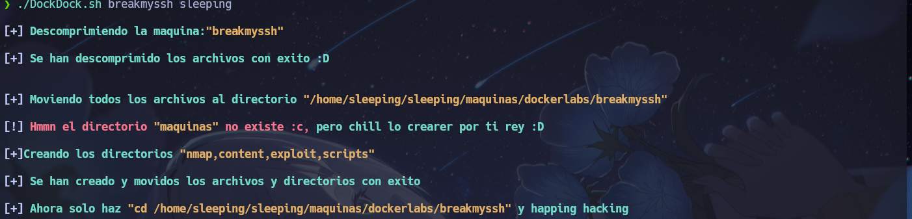
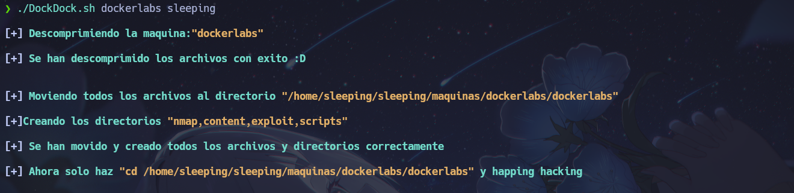

# DockDock
Un simple script en bash que descomprime el archivo .zip de la maquina y crea un directorio de trabajo y hace la funcion mkt creando los directorios "nmap,content,exploits,scripts" para estar mas comodo realizando la maquina :D

# No olvides hacer chmod +x DockDock.sh ;)

