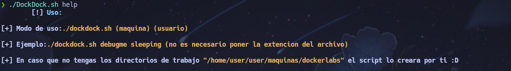

# DockDock
Un simple script en bash que descomprime la maquina y te crea un directorio de trabajo y hace la funcion mkt creando los directorios "nmap,content,exploits,scripts" para estar mas comodo realizando la maquina :D

